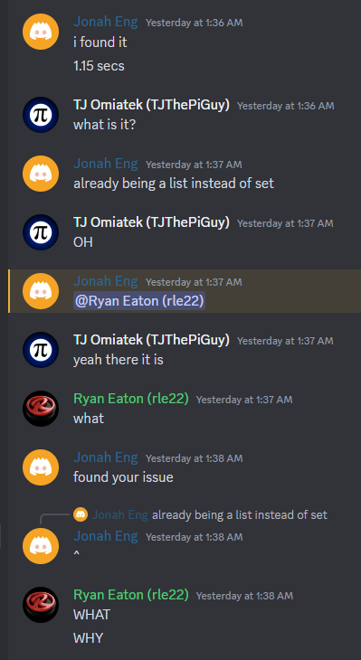

# Day 16
A good lesson in Part 2.

|      | Part 1 | Part 2 | Total   |
|------|--------|--------|---------|
| Time | 35:36  | 37:49  | 1:13:25 |

## Part 1
This code was rather straightforward, just took me a while to make it. It basically just moves each active light beam properly at each time step, and never moves to somewhere where it's already been moving the same direction as it had before.
```python
from helpers.datagetter import aocd_data_in

din, aocd_submit = aocd_data_in(split=True, numbers=False)
ans = 0

for i in range(len(din)):
    din[i] = [c for c in din[i]]


def in_range(i, j):
    if 0 <= i < len(din) and 0 <= j < len(din[0]):
        return True
    return False


def move(bms):
    out = []
    for bm in bms:
        d = bm["dir"]
        x, y = bm["pos"]
        c = din[x][y]
        if d == 0:
            if c in ".|":
                out.append({"dir": d, "pos": (x - 1, y)})
            if c in "\\-":
                out.append({"dir": 3, "pos": (x, y - 1)})
            if c in "/-":
                out.append({"dir": 1, "pos": (x, y + 1)})
        elif d == 1:
            if c in ".-":
                out.append({"dir": d, "pos": (x, y + 1)})
            if c in "\\|":
                out.append({"dir": 2, "pos": (x + 1, y)})
            if c in "/|":
                out.append({"dir": 0, "pos": (x - 1, y)})
        elif d == 2:
            if c in ".|":
                out.append({"dir": d, "pos": (x + 1, y)})
            if c in "\\-":
                out.append({"dir": 1, "pos": (x, y + 1)})
            if c in "/-":
                out.append({"dir": 3, "pos": (x, y - 1)})
        elif d == 3:
            print("test", c, )
            if c in ".-":
                out.append({"dir": d, "pos": (x, y - 1)})
            if c in "\\|":
                print(d, x, y)
                out.append({"dir": 0, "pos": (x - 1, y)})
            if c in "/|":
                out.append({"dir": 2, "pos": (x + 1, y)})
    return out


beams = [{"dir": 1, "pos": (0, 0)}]
already = [{"dir": 1, "pos": (0, 0)}]

print(beams)

while len(beams):
    new_beams = []
    for beam in move(beams):
        if beam not in already and in_range(beam["pos"][0], beam["pos"][1]):
            new_beams.append(beam)
            already.append(beam)
    beams = new_beams.copy()
    print(beams)

uniq = []
for bm in already:
    if bm["pos"] not in uniq:
        uniq.append(bm["pos"])

aocd_submit(len(uniq))
```

## Part 2
A simple change to make it check each starting point, then pick the highest score. But it was projected to take quite long, upwards of 8 minutes. I heard my friends in NJIT ACM had runtimes on the order of < 5 seconds so I was very confused. I would let me program run and, even though I knew it would produce the correct answer, I kept stopping it part-way through because I thought I had the solution. But I didn't, so instead of having an 8 minute delta, I took 40 minutes stopping and starting before I just let it run to completion. Explanation in Part 3.
```python
import functools
from helpers.datagetter import aocd_data_in
import tqdm
import time

din, aocd_submit = aocd_data_in(split=True, numbers=False)

for i in range(len(din)):
    din[i] = [c for c in din[i]]


def in_range(i, j):
    if i in range(len(din)) and j in range(len(din[0])):
        return True
    return False


@functools.cache
def move(bm):
    out = []
    d = bm[0]
    x, y = bm[1], bm[2]
    c = din[x][y]
    if d == 0:
        if c in ".|":
            out.append((d, x - 1, y))
        if c in "\\-":
            out.append((3, x, y - 1))
        if c in "/-":
            out.append((1, x, y + 1))
    elif d == 1:
        if c in ".-":
            out.append((d, x, y + 1))
        if c in "\\|":
            out.append((2, x + 1, y))
        if c in "/|":
            out.append((0, x - 1, y))
    elif d == 2:
        if c in ".|":
            out.append((d, x + 1, y))
        if c in "\\-":
            out.append((1, x, y + 1))
        if c in "/-":
            out.append((3, x, y - 1))
    elif d == 3:
        if c in ".-":
            out.append((d, x, y - 1))
        if c in "\\|":
            out.append((0, x - 1, y))
        if c in "/|":
            out.append((2, x + 1, y))
    return out


def start_at(direction, x, y):
    beams = [(direction, x, y)]
    already = []

    while len(beams):
        new_beams = []
        for b in beams:
            if b in already or not in_range(b[1], b[2]):
                continue
            already.append(b)
            bb = move(b)
            for beam in bb:
                new_beams.append(beam)
        beams = new_beams.copy()

    dict = {}
    for bm in already:
        dict["%s, %s" % (bm[1], bm[2])] = 1

    return len(dict)

m = []
for i in tqdm.tqdm(range(len(din))):
    m.append(start_at(1, i, 0))
    m.append(start_at(3, i, len(din[0]) - 1))

for j in tqdm.tqdm(range(len(din[0]))):
    m.append(start_at(2, 0, j))
    m.append(start_at(0, len(din) - 1, j))

aocd_submit(max(m))
```

## Part 3
I couldn't figure it out, it took the help of [Jonah Eng](https://github.com/engjonah) and [Thomas Omiatek](https://github.com/TJThePiGuy) to get to the bottom of it.

At first, I thought it was the move function. So I cached it, but it didn't speed it up too much at all. It helped, but the bottleneck clearly wasn't there.

I'm writing this two days later, so I don't remember everything I tried... but I do know the solution now!



My `already` variable. Completely unrelated to the `move` function or any of the more complicated logic, I was using a Python list to keep track of nodes that have already been visited. That way, I can avoid looping and know when to stop pursuing a light beam. I never expected this to be the culprit, but now that I know, I can prove it!

Checking whether a value exists in a list has a worst case time complexity of `O(n)` where `n` is the number of elements in a list. This is because you need to scan through the entire list and check equality of each element before you can be sure that something is not inside the list. In the vast majority of lookups into this `already` list, the light beam will not have been seen before.

So, at each iteration of light beams, we can assume that on average we are looking through all the prior visited locations. So at iteration 1, you look through an empty list, at iteration 2 you look through a list of size 1, 3 -> 2, 4 -> 3, etc. For my input, this was around 7500 on average, so for each starting location and for each iteration that's:
0 + 1 + 2 + 3 + 4 + 5 + ... + 7499 ≈ 28.1 million.
That's a few more, on the order of `O(n^2)`. For all 440 starting locations on my input, that's ***12.3 billion*** list elements scanned just to prevent looping a couple of times.

When using a `set()`, a lookup to check if an element is inside of it uses a hashmap. In simple terms, each element is associated with a number, which can be used as an index into a list (a map of hashes!). So checking if a given element is inside a set means hashing that element, then jumping to that index in the hashmap and seeing if it's been flagged as in the set.
This is a simplified explanation of how it works, but in general using a `set()` transforms element inclusion from a `O(n)` scan into an `O(1)` lookup. A little bit better, don't you think?

Much better. Our ***12.3 billion*** element checks is now shrunk to ***3.3 million***. 7500 for each of 440 starting points. A measly ***3720x*** fewer checks. Now it runs in just over 1 second with caching (2 without).

The 2-line modification can be found at [/code/day16c.py](/code/day16c.py) if you're super curious.

Over all, I was surprised that such a relatively unimportant and valid part of the code could slow it down so much, but of course it makes perfect sense why.