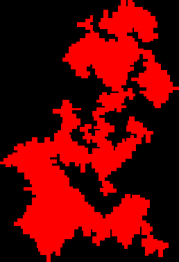

# Day 18
Cool theorem learned in Part 2.

|      | Part 1 | Part 2  | Total   |
|------|--------|---------|---------|
| Time | 19:34  | 1:40:04 | 1:59:38 |

## Part 1
I *really* wanted to do it with flood-fill in an image, and I checked the sizes and it was only 258 x 378 for my input, so I just generated an image, flood filled it in [Paint.net](https://www.getpaint.net/), then used the magic wand to select the red color. Paint.net provides a nice count of selected pixels, so I was able to submit that as my answer.
```python
from helpers.datagetter import aocd_data_in
from collections import defaultdict
from PIL import Image

din, aocd_submit = aocd_data_in(split=True, numbers=False)
ans = 0

ground = defaultdict(str)
at = [0, 0]

x_0, x_1, y_0, y_1 = float('inf'), float('-inf'), float('inf'), float('-inf')

for line in din:
    d, n, color = line.split(" ")

    directions = ["U", "R", "D", "L"]
    d = directions.index(d)

    for _ in range(int(n)):
        if d == 0:
            at[0] -= 1
        elif d == 1:
            at[1] += 1
        elif d == 2:
            at[0] += 1
        else:
            at[1] -= 1
        ground[",".join(map(str, at))] = color
        x_0 = min(x_0, at[0])
        x_1 = max(x_1, at[0])
        y_0 = min(y_0, at[1])
        y_1 = max(y_1, at[1])

print(ground)
width = abs(x_0 - x_1) + 1
height = abs(y_0 - y_1) + 1

print(width, height)

im = Image.new(mode="RGB", size=(width, height))
for pixel, color in ground.items():
    x, y = map(int, pixel.split(","))
    print(x, y)
    im.putpixel((x - x_0, y - y_0), tuple(int(color[2:-1][i:i+2], 16) for i in (0, 2, 4)))

im.show()
# im.save("a.png")
# Flood fill in paint.net, then use magic wand to select, and count is visible on bottom left
```




And for fun, if the colors mattered:


## Part 2
I initially tried a similar solution to [Day 10](./10.md) but I quickly realized that was a dead end. Quickly as in 1 hour...

Then I did some searching online for finding the area of polygons, and stumbled across the [Shoelace Formula](https://en.wikipedia.org/wiki/Shoelace_formula). Don't ask me how it works, I'll figure that out in the morning. But, it can be trusted to provide the signed area of a polygon given an ordered list of vertices, which we have since we are traversing in order.

So, I found a Python module that did it for me: [skspatial.measurement.area_signed](https://scikit-spatial.readthedocs.io/en/latest/api_reference/measurement/functions/skspatial.measurement.area_signed.html). Thank you very much! But the answer was orders of magnitude off, and I could not figure out why. Until 30 minutes into my shoelace endeavor, I remembered overflow. Big numbers and multiplication don't mesh well. So I had a look at the [source code](https://scikit-spatial.readthedocs.io/en/stable/_modules/skspatial/measurement.html) of the `area_signed` function and saw that it was using normal numpy arrays of ints, which are limited to 32 bits
I inspected the result of two random values and saw that it would be way larger than `2^31-1`. So, I made my own function, copying most of it, except initializing the `numpy` array to use `np.int64` as its datatype. This produced a close answer!

Since we are on a grid and we need to count grid cells, the area won't exactly work. The vertices are exactly at the center of pixels, so a corner would only count 0.25 of a pixel, when in reality we'd want to count the entire pixel. For straight sections of edges, there are 0.5 inside and 0.5 outside. Since the shape is closed, I figured that there was probably some property that said that there would be as much of the perimeter outside the shape as inside, so I added half of the perimeter to the area, and noticed it was 1 less than the example, so I just added 1. Perhaps because when moving around in a circle an entire pixel is lost when doing the half perimeter thing. Reminds me of this [Veritasium Video](https://www.youtube.com/watch?v=FUHkTs-Ipfg) I saw a couple of weeks ago.   

This code would also work for Part 1, with the input reader slightly modified, which is nice.
```python
from helpers.datagetter import aocd_data_in
import tqdm
import numpy as np

din, aocd_submit = aocd_data_in(split=True, numbers=False)

ground = []
at = [0, 0]
perimeter = 0


def shoelace(points):
    # Ripped from skspatial.measurement.area_signed, but with np.int64
    points = np.array(points, dtype=np.int64)
    n_points = points.shape[0]

    X = points[:, 0]
    Y = points[:, 1]

    indices = np.arange(n_points)
    indices_offset = indices - 1

    return 0.5 * np.sum(X[indices_offset] * Y[indices] - X[indices] * Y[indices_offset])


for line in tqdm.tqdm(din):
    color = line.split("(")[1]
    
    d = int(color[-2])
    n = int(color[1:-2], 16)
    perimeter += n

    if d == 3:
        at[0] -= n
    elif d == 0:
        at[1] += n
    elif d == 1:
        at[0] += n
    else:
        at[1] -= n
    ground.append(at.copy())

aocd_submit(int(abs(shoelace(ground)) + perimeter / 2 + 1))
```